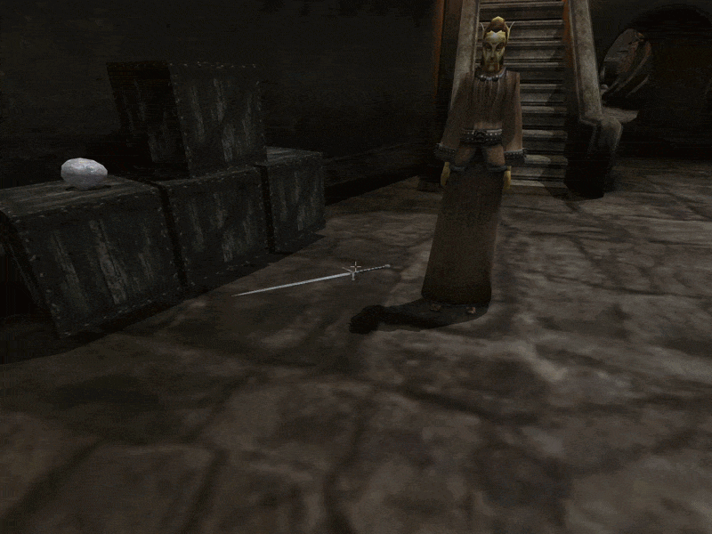
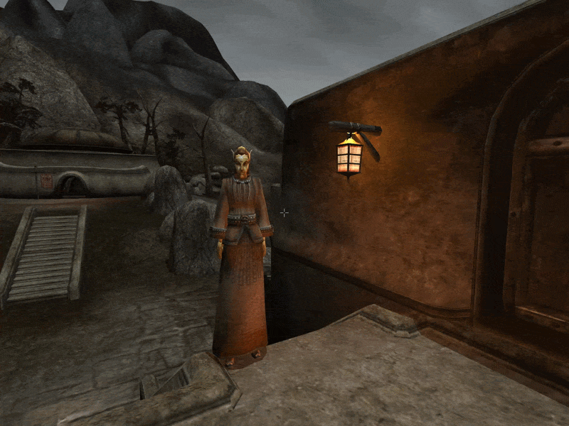

# Follower Commands (OpenMW)

Adds a hotkey to give followers commands based on what you're looking at.

  
  

## Commands

They're based on what you're looking at.

- **Actor** -> Kill him
- **Locked/trapped door/container** -> Unlock/untrap it, if possible
  - One human actor is picked based on lockpick/probe and their skills
- **Trapped door/container for the second time** -> Face tank it. Or not. Depends on the mood of the team
  - One actor is picked based on their current health
  - Summons have a priority
- **Unlocked container or item** -> Pick it up, if there's space
  - One human actor is picked based on his free carry capacity
- **Terrain or statics** -> Travel there

Note that no sneak checks are done. I trust that you won't abuse the system.  
Don't let me down.

## Requirements

- [Follower Detection Util](https://www.nexusmods.com/morrowind/mods/58053)

## Recommended mods

- [Actor Interactions](https://www.nexusmods.com/morrowind/mods/57955) by Implawyer - Since not every companion has Companion Share feature, whitout this mod some of them might not give loot back to you
- [Friendlier Fire](https://www.nexusmods.com/morrowind/mods/57975) by me

## Credits

**Sosnoviy Bor** - Author  
**DubiousNPC** - Animations  
**Leo and Universal Animation Library** - Looting animations ([120 Animations Pack for Morrowind](https://www.nexusmods.com/morrowind/mods/56734))  
**Merlord** - Inspiration ([Kill Command](https://www.nexusmods.com/morrowind/mods/46723))  
**abot** - Inspiration ([Smart Companions](https://www.nexusmods.com/morrowind/mods/49848))
